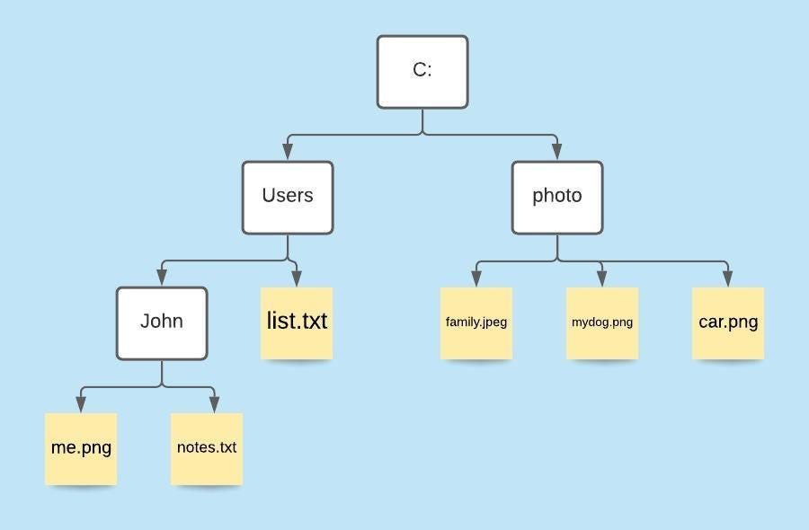
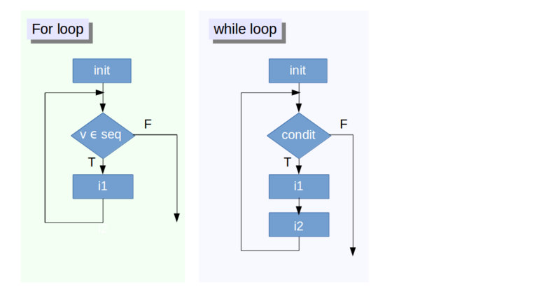

### Martes, 19 de septiembre, 2023

# Entrada de datos a R y RStudio <a name = "inicio"></a>

### Índice
- [Entrada de datos](#inicio)

  -[Lectura de datos desde un archivo de texto](#import_data)
  
  -[Ejercicio 1](#ejercicio1)
  
  -[Mantener los datos en R](#keep_in_object)
  
  -[Bajar un archivo de Internet](#download_data)
  
- [Manipulación, formateo y limpieza de datos](#data_handling)

  -[Subconjunto de datos](#data_subset)
  
  -[Ejercicio 2](#ejercicio2)
  
  -[Acceder a los elementos utilizando sus índices](#subset_by_index)
  
  -[Subconjunto por nombre](#subset_by_name)
  
  -[Ejercicio 3](#ejercicio3)
  
  -[Data frames](#dataframe)
  
  -[Ejercicio 4](#ejercicio4)
  
  -[Ejercicio 5](#ejercicio5)
  
  -[Ejercicio 6](#ejercicio6)
  
  -[Ejercicio 7](#ejercicio7)
  
  -[Mofificar un data.frame mediante operaciones](#df_modif_operations)
  
  -[Ejercicio 8](#ejercicio8)
  
- [Manejo de datos faltantes](#missing_data)

  -[Comprobación de valores faltantes](#check_missing_data)
  
  -[Recodificación de valores ausentes](#recode_missing_data)
  
  -[Exclusión de valores perdidos de los análisis](exclude_missing_data)

  -[Ejercicio 9](#ejercicio9)
  
- [Loops](#loops)

  -[Ejercicio final. Lectura masiva de archivos guardados en una carpeta](#Ejercicio_final)
  
  


> :bulb: <i>Recuerda</i><br> - **Comentarios**<br> R ignora (es decir, no ejecuta) cualquier texto a la derecha del símbolo `#` para esa línea. Esto le permite escribir comentarios, texto que es ignorado por R pero leído por otros humanos. A veces incluiremos comentarios en ejemplos explicando lo que sucede con el código.<br> Los comentarios son útiles para describir brevemente lo que hace el código.

## Lectura de datos desde un archivo de texto (importar datos en R)  <a name = "import_data"></a>

Para empezar, nos centraremos en el tipo de archivo de datos rectangulares más comunes: - `CSV`, que es la abreviatura de **valores separados por comas** y - `TAB`, que representa **valores separados por tabulaciones**.

Este es el aspecto de un archivo sencillo. La primera fila, comúnmente llamada fila de encabezados, tiene los nombres de las columnas, y las filas siguientes proporcionan los datos.

Las columnas pueden estar separadas por comas:

```         
species,island,bill_length_mm,bill_depth_mm,flipper_length_mm,body_mass_g,sex,year
Adelie,Torgersen,39.1,18.7,181,3750,male,2007
Adelie,Torgersen,39.5,17.4,186,3800,female,2007
Adelie,Torgersen,40.3,18,195,3250,female,2007
Adelie,Torgersen,NA,NA,NA,NA,NA,2007
Adelie,Torgersen,36.7,19.3,193,3450,female,2007
Adelie,Torgersen,39.3,20.6,190,3650,male,2007
```

o por tabulaciones:

```         
species island  bill_length_mm  bill_depth_mm   flipper_length_mm   body_mass_g sex year
Adelie  Torgersen   39.1    18.7    181 3750    male    2007
Adelie  Torgersen   39.5    17.4    186 3800    female  2007
Adelie  Torgersen   40.3    18  195 3250    female  2007
Adelie  Torgersen   NA  NA  NA  NA  NA  2007
Adelie  Torgersen   36.7    19.3    193 3450    female  2007
Adelie  Torgersen   39.3    20.6    190 3650    male    2007
```

La función mas general para leer una tabla en R es `read_table()`. Lee archivos de **ancho fijo** en la que las columnas están separadas (por defecto) con espacios en blanco.

El primer argumento de la función es el más importante: **la ruta al archivo**. Puedes pensar en la ruta como la dirección del archivo: el archivo se llama **penguins_matrix_space-delim.txt** y está guardado en la carpeta **datasets**. Esta se encuentra en el folder "madre" del directorio actual (representado en el ejemplo abajo por `../`). 

> :question: Pregunta:<br> ¿Qué es <i>ruta absoluta</i> y <i>ruta relativa</i>).?




```{r}
# Leer una tabla guardada en el disco
read.table("../datasets/penguins_matrix_space-delim.txt")
```

Por defecto la función `read.table()` no interpreta la primera fila como los encabezados de columnas. Para agregar esta información se incluye el argumento `header = TRUE` o también su forma comprimida `h = T`.

> :question: Pregunta:<br> ¿Qué ventajas ofrece usar opciones completas vs. comprimidas en los argumentos de las funciones?

```{r}
# Leer una tabla guardada en el disco indicando que la primera fila tiene los nombres de cada columna

```

> :question: Pregunta:<br> ¿Hay alguna limitación con el uso de `espacio` como delimitador de columnas?


- Leer una matriz de datos indicando el separador de columnas

Incluyendo el argumento `sep =` puede leer una tabla con otros tipos de caracteres delimitadores de columnas. Puede utilizar caracteres personalizados. Por ejemplo, para indicar que el archivo de texto está delimitado por tabulaciones (`TAB`), incluimos el argumento `"sep = \t"`.

- Leer una matriz de datos indicando el separador de cifras decimales

Incluyendo el argumento `dec =` puede leer una tabla con caracteres para separar las cifras decimales diferentes a punto (`.`)

---
:exclamation::exclamation::exclamation: **Tenga en cuenta que** en R hay funciones específicas para leer tablas con diferentes delimitadores:

-   `read.csv()` lee archivos separados por coma.
-   `read.csv2()` lee archivos separados por punto y coma (`;`) y coma (`,`) como marcador decimal.
-   `read.delim()` lee archivos delimitados por tabuladores.
-   `read.delim2()` lee archivos delimitados por tabuladores y coma (`,`) como marcador decimal. 
---


**Ejercicio 1** <a name = "ejercicio1"></a>: Explore las versiones de la matriz de datos de los pingüinos que tenemos en la carpeta `datasets`. Descubra qué saparador de columnas tiene cada versión y léalas en R con las funciones y argumentos apropiados.

:bulb: **Consejo:** Revise la ayuda de las funciones (e.g. ejecutando en la consola `?read.csv`) para ver qué valores por defecto usa para los diferentes argumentos.

```{r}


```

### Mantener los datos en R <a name = "keep_in_object"></a>

Hasta ahora, con los comandos utilizados logramos que R lea los archivos seleccionados y vizualizarlos en la consola. Sin embargo, para procesar y analizar los datos en R, necesitamos mantener la matriz de datos cargada en el Espacio de Trabajo (o [workspace](https://www.marcusrb.com/cursos/r-studio/workspace/), también consulte [aquí](https://rpubs.com/daniballari/intro_espaciotrabajo_archivos)). Para esto hay que asignarla a un objeto (o varible) nuevo en el ambiente con un nombre específico utilizando una *flecha* `<-` o el símbolo *igual que* `=`.

```{r}


```

### Bajar un archivo de Internet <a name = "download_data"></a>

- Paso 1: Obtener la URL del archivo

Primero, necesitamos copiar la URL donde están almacenados nuestros datos. En este ejemplo, vamos a utilizar un archivo `.csv` de este sitio web: https://www.stats.govt.nz/large-datasets/csv-files-for-download/

En el sitio web, puedes encontrar una lista de archivos `.csv` descargables. Haz clic con el botón derecho en uno de ellos y copia la ubicación del enlace:

Ahora, almacena esta ubicación de enlace en un objeto de R como cadena de caracteres:

```{r}
# Especificar la URL donde se almacena el archivo
url <- "https://www.stats.govt.nz/assets/Uploads/Annual-enterprise-survey/Annual-enterprise-survey-2017-financial-year-provisional/Download-data/annual-enterprise-survey-2017-financial-year-provisional-csv.csv"
```
 
- Paso 2: Establecer el destino del archivo

Además de la ubicación del enlace, también necesitamos especificar en qué parte de nuestro ordenador queremos guardar los datos. El siguiente código R ilustra cómo definir la ruta del directorio de salida:

```{r}
# Especificar el destino donde se debe guardar el archivo
destfile <- "C:/Usuarios/ ... Su ruta ... /mi_carpeta/archivo_de_la_web.csv"
```

- Paso 3: Descargar archivo con R

Ahora que tenemos toda la información necesaria para descargar el archivo deseado, podemos proceder.

La función base de R `download.file()` nos permite descargar nuestro archivo y guardarlo en el directorio especificado. Sólo tenemos que indicar a la función la nuestro objeto `URL` (objeto creado en el paso 1) y la carpeta de destino almacenado en el objeto `destfile` (objeto creado en el paso 2):

```{r}
# Aplicar la función download.file en R


```

Revisa la carpeta que has especificado como destino del archivo. Debería encontrar los datos descargados en formato `.csv`. Ahora podemos utilizar alguna de las funciones que ya vimos para cergar los datos que bajamos en R.

---
:speech_balloon: NOTA:<br>
R permite descargar  cualquier formato de archivo. En el ejemplo anterior, hemos descargado un archivo `.csv`. Sin embargo, también puede descargar archivos Excel (`.xlsx` / `.xls`), archivos de text `.txt`, archivos comprimidos `.zip`, archivos `PDF`, etc.
---


# Manipulación, formateo y limpieza de datos <a name = "data_handling"></a>

## Subconjunto de datos <a name = "data_subset"></a>

R dispone de numerosos operadores de subconjuntos. Dominarlos le permitirá realizar fácilmente operaciones complejas en cualquier conjunto de datos. Hay seis formas diferentes de submuestrear cualquier tipo de objeto, y tres operadores de subconjunto diferentes para las distintas estructuras de datos. 

Empecemos con el caballo de batalla de R: creemos simple vector numérico.

```{r}
### Hacer un vector numérico y asignarle nombre a cada elemento del vector


```

> :speech_balloon: En R, los vectores simples que contienen cadenas de caracteres, números o valores lógicos se denominan vectores atómicos porque no se pueden simplificar más.

Ahora que hemos creado un vector de muestra con el que podemos jugar, ¿cómo podemos acceder a su contenido?


### Acceder a los elementos utilizando sus índices <a name = "subset_by_index"></a>

Para extraer elementos de un vector podemos dar su índice correspondiente (empezando por uno):

```{r}
## extraer el primer elemento del vector x

```
```{r}
## extraer el cuarto elemento del vector x

```

Aunque no sea obvio, el operador peréntesis recto `[ ]` es una función. Para vectores (y matrices), significa "muéstrame el n-ésimo elemento".

También podemos pedir varios elementos a la vez:
```{r}
## extraer el primero y el tercer elementos del vector x


```

O porciones del vector:
```{r}
## extraer DEL primero AL cuarto elemento del vector x


```


También podemos extraer el mismo elemento varias veces:
```{r}
## extraer el primero, primero y trecer elementos de x


```

Si llamamos un índice más allá de la longitud del vector :grimacing:, R devolverá un valor faltante :
```{r}
## extraer el sexto elemento de x (que solo tiene cinco elementos)


```
En este caso el resultado es un vector de longitud uno que contiene un `NA`, y el nombre del elemento también es `NA`.

Finalmente, si pedimos el elemento 0, obtenemos un vector vacío:
```{r}


```

---
:speech_balloon: NOTA:<br>
- La numeración (índices) en R empieza en 1.
- En la mayoría de lenguajes de programación (**C** y **Python**, por ejemplo), la numeración de los índices inicia en 0. **En R, el primer elemento tiene índice 1.**
---


- Saltar y eliminar elementos

Si utilizamos un **número negativo** como índice de un vector, R devolverá todos los elementos excepto el especificado:
```{r}
## eliminar el segundo elemento de x 


```

Podemos omitir varios elementos:
```{r}
## eliminar el primero y quinto elemento de x 


```

---
:exclamation::exclamation::exclamation: **Importante**: Orden de las operaciones<br>

Si uno intenta negar una secuencia así:
```{r}
x[-1:3]
```
Va a dar un error un tanto confuso :flushed:

**Entonces recuerda el orden de las operaciones**. Recuerda `:` es en realidad una función. En este caso toma como primer argumento `-1`, y como segundo argumento `3`, por lo que genera la secuencia de números: `c(-1, 0, 1, 2, 3)`.<br>
La solución correcta es encerrar esa llamada a la función entre paréntesis, de modo que primero se haga la secuencia y luego el operador `-` se aplique al resultado:
```{r}
x[-(1:3)]
```
---


Para eliminar (definitivamente) los elementos de un vector, tenemos que volver a asignar el resultado a la variable:
```{r}
x <- x[-(1:3)]
```

**Ejercicio 2** <a name = "ejercicio2"></a>:
Dado el siguiente código:
```{r}
x <- c(5.4, 6.2, 7.1, 4.8, 7.5)
names(x) <- c('a', 'b', 'c', 'd', 'e')
print(x)
```

Elabora al menos 3 comandos diferentes que produzcan el siguiente resultado:
```{r}
  b   c   d
6.2 7.1 4.8
```
Después de encontrar 3 comandos diferentes, compara notas con tu compañero. ¿tienen estrategias diferentes?
```{r}


```


### Subconjunto por nombre <a name = "subset_by_name"></a>

Podemos extraer elementos utilizando su nombre, en lugar de extraer por el índice:
```{r}
# Crear un vector asignando nombres "sobre la marcha"


```

Extraer los elementos con nombre `a` y `c` 
```{r}
x[c("a", "c")]
```
Esta suele ser **una forma mucho más fiable** de hacer subconjunto objetos: la posición de varios elementos puede cambiar a menudo al encadenar operaciones de subconjunto, **¡pero los nombres siempre serán los mismos!**

- Subconjunto mediante otras operaciones lógicas

También podemos utilizar cualquier vector lógico para hacer subconjunto de datos:
```{r}
x[c(FALSE, FALSE, TRUE, FALSE, TRUE)]
```
(o también)
```{r}
x[c(F, F, T, F, T)]
```

Dado que los operadores de comparación (p. ej. `>` , `<` , `==`) evalúan vectores lógicos, también podemos utilizarlos para hacer subconjunto de vectores de forma sucinta: La siguiente expresión da el mismo resultado que la anterior.
```{r}
x[x > 7]
```
Viéndolo en detalle, esta expresión evalúa primero `x>7`, generando un vector lógico
`c(FALSE, FALSE, TRUE, FALSE, TRUE)`, y luego selecciona los elementos de x correspondientes a los valores `TRUE`
verdaderos.


Finalmente, podemos utilizar el comparador "igual que" `==` para imitar el método anterior de submuestreo por nombre (:exclamation: recuerde que debe utilizar `==` en lugar de `=` para las comparaciones):
```{r}
x[names(x) == "a"]
```


- **Combinar condiciones lógicas**

A menudo queremos combinar varios criterios lógicos. 

> :speech_balloon: En R existen varias operaciones para combinar vectores lógicos:<br>
`&` , el operador **AND lógic**: devuelve `TRUE` si ambas condiciones son verdaderas.
`|` , el operador **OR lógic**: devuelve `TRUE` , si una (o ambas) son verdaderas.<br>
(A veces verá `&&` y `||` en lugar de `&` y `|`.
Estos operadores de dos caracteres sólo miran el primer elemento de cada vector e ignoran los elementos restantes. En general, no debe utilizar los operadores de dos caracteres en el análisis de datos; resérvelos para la programación, es decir, para decidir si se ejecuta o no una sentencia).<br>
Además, el operador lógico `NOT` convierte `TRUE` en `FALSE` y `FALSE` en `TRUE`.<br>
Puede negar una única condición lógica (por ejemplo, `!TRUE` se convierte en `FALSE`) o un vector completo de condiciones (por ejemplo, `!c(TRUE, FALSE`) se convierte en `c(FALSE, TRUE)`).<br>
Además, puede comparar los elementos de un mismo vector mediante la función `all()` que devuelve `TRUE` si todos los elementos del vector son `TRUE`) y la función `any()` (que devuelve `TRUE` si uno o más elementos del vector son `TRUE`).
> :question: ¿Cómo obtener ayuda sobre los operadores?
Recuerde que puede buscar ayuda sobre los operadores con la función `help()` o solo `?` (no olvide encerrárlos entre comillas). Ejemplo: `help("&")` o `?"&%"`.

**Ejercicio 3** <a name = "ejercicio3"></a>. Dado el siguiente código:
```{r}
x <- c(5.4, 6.2, 7.1, 4.8, 7.5)
names(x) <- c('a', 'b', 'c', 'd', 'e')
print(x)
```
Escribe una orden de submuestreo que devuelva los valores de x mayores que 4 y menores que 7.
```{r}

```


## Data frames <a name = "dataframe"></a>


Los data.frames pueden entenderse como una "lista de vectores" apilados en columnas (y por ende, objetos **bidimensionales**), entonces aplican reglas similares.

Los paréntesis rectos `[ ]` actúan de la misma manera que para las listas, donde cada elemento del data.frame corresponde a una columna. :eyes: El objeto resultante será un data.frame. Obtenga la tercera columna del data frame de los pingüinos:
```{r}

```

Similarmente, usando doble paréntesis rectos `[[ ]]` da como resultado una columna. Pero el resultado es un vector. Obtenga la tercera columna del data frame de los pingüinos con doble paréntesis:
```{r}

```


Adicionalmente, `$` proporciona una práctica abreviatura para extraer columnas por nombre. Extraiga la columna `bill_length_mm` de los datos de los pingüinos:
```{r}


```

Para seleccionar filas y/o columnas específicas, puede usar paréntesis cuadrados `[ ]`.

Para esto lo importante es saber que podemos separar los índices de fila y columna con coma (`,`). Índices de filas van a la izquierda de la coma e índices de columna a la derecha de la coma.

Si queremos extraer solo filas, el resultado será un data.frame (porque los elementos son de tipos mixtos). Extraer las tres pirmeras columnas:
```{r}


```

Si extraemos una sola columna, el resultado será un vector. Extraer la tercera columna:
```{r}


```

Ahora extraigamos filas y columnas específicas:
```{r}


```

**Ejercicio 4:** <a name = "ejercicio4"></a> (para particar un poco de todo lo que hemops visto).

- **a.** En nuestro juego de datos de los pigüinos, encontrar todos los pingüinos hermbra, que fueron medidos en el 2009 y pesan 3 kg o más. 

```{r}


```
- **b.** ¿Cuántos registros tenemos con las condiciones requiridas en *a*.?
```{r}


```
- **c.** Mostrar solo las columnas "Species" y "island" de los registros con las condiciones requiridas en *a*.
```{r}


```
- **d.** Crear un nuevo objeto que contenga solo los registros de pinguinos macho de la isla Biscoe y uqe la longitud de la aleta sea menor o igual a 150. Explore el nuevo objeto (i.e. ¿cuántas filas tiene?, ¿De qué años son las muestras?)
```{r}


```


- Otras formas de obtener subconjunto de los datos. Función `subset()`.

**Ejercicio 5:** <a name = "ejercicio5"></a>

**a.** Verifique los argumentos de la función `subset()` y cree un nuevo elemento que muestre la información de las muestras que tienen profundidad de pico mayor o igual a 17.15 mm.
```{r}


```

**b.** Ahora cree un nuevo elemento que contenga un nuevo subconjunto de datos a partir del creado en **a.** con la información de las muestras que provienen de la isla "Dream" y solo las columnas especies y masa corporal.
```{r}


```


**Ejercicio 6:** <a name = "ejercicio6"></a>
Corrija cada uno de los siguientes errores comunes de subconjunto de data frames:

1. Extracto de las observaciones recogidas para el año 2007:
```{r}
datos_pinguinos[datos_pinguinos = 2007, ]
```
2. Extraer todas las columnas excepto de la 1 a la 4:
```{r}
datos_pinguinos[, -1:4]
```
3. Extraer las filas en las que el largo del pico es superior a 40 mm:
```{r}
datos_pinguinos[datos_pinguinos$bill_length_mm > 40]
```
4. Extraiga la primera fila y las columnas cuarta y quinta ( "bill_depth_mm" y "flipper_length_mm" ):
```{r}
datos_pinguinos[1, 4, 5]
```
5. Extract rows that contain information for the years 2002 and 2007:
```{r}
datos_pinguinos[datos_pinguinos$year == 2007 | 2009,]
```

**Ejercicio 7:** <a name = "ejercicio7"></a>

1. ¿Por qué `datos_pinguinos[1:20]` devuelve un error? ¿En qué se diferencia de `datos_pinguinos[1:20, ]`?

2. Cree un nuevo data.frame llamado `datos_pinguinos_mini` que sólo contenga las filas 1 a 9 y 19 al 23. Puede hacerlo en uno o dos pasos.


---
**Síntesis:**
1. La indexación en R empieza en 1, no en 0.
2. Acceda a valores individuales por ubicación utilizando `[ ]`.
3. Accede a los segmentos de datos mediante `[inicio:fin]`.
4. Accede a conjuntos arbitrarios de datos mediante `[c(...)]`.
5. Utilizar operaciones lógicas y vectores lógicos para acceder a subconjuntos de datos.
---


### Modificar un data.frame mediante operaciones entre columnas <a name = "df_modif_operations"></a>

Se puede acceder a un data.frame y modificarlo para almacenar nuevas variables que no están presentes en el archivo original (datos brutos). El data.frame puede sufrir cambios para aumentar sus dimensiones y almacenar más datos, así como los valores de filas y columnas, que pueden modificarse en función de los valores de otras celdas. 

Una de las tareas más fáciles de realizar en R es añadir una nueva columna a un marco de datos basándose en otra u otras columnas. Es posible que desee sumar varias de las columnas existentes, encontrar una media o calcular algún "resultado" a partir de los datos existentes.


- **Opción 1:** Por ecuación

Basta con crear un nombre de variable para la nueva columna y pasar una fórmula de cálculo para obtener el valor deseado, por ejemplo, si queremos una nueva columna que sea la suma de dos columnas existentes:

`dataFrame$sumCol1Col2 <- dataFrame$Col1 + dataFrame$Col2`

Como probablemente puedes adivinar, esto crea una nueva columna llamada *sumCol1Col2* con la suma de *Col1* + *Col2* en cada fila.


**Opción 2:** Función `transform()` de R

Esta es otra forma de lograr lo que hicimos anteriormente. Aquí está la sintaxis básica de transform():

`dataFrame <- transform(dataFrame, NuevaColumna = alguna ecuación)`

Entonces, puedes obtener la suma de dos columnas y almacenarla en una nueva columna con `transform()` con este código:

`dataFrame <- transform(dataFrame, sumCol1Col2 = Col1 + Col2)`


**Ejercicio 8:** <a name = "ejercicio8"></a>

**a.** En nuestro data frame (datos_pinguinos), añadir una columna que muestre la relación entre largo y alto del pico de los pingüinos muestreados:
```{r}


```

**b.** Convertir de unidad la variable peso corporal a kilogramos. 
```{r}


```

**c.** Redondear a un solo decimal la nueva variable obtenida en b con la función `round()`. Esta función toma esta forma `round(número(s) a redondear, cuántos decimales desea)`.
```{r}


```


# Manejo de datos faltantes <a name = "missing_data"></a>

Muchas funciones en R no pueden manejar datos faltantes, infinitos o indefinidos. Hay una serie de funciones especiales que puede utilizar para filtrar estos datos.

## Comprobación de valores faltantes <a name = "check_missing_data"></a>

Para identificar valores faltantes, la función `is.na()` devuelve un vector lógico con `TRUE` en las posiciones de los elementos que contienen valores faltnates representados por `NA`. `is.na()` funciona con vectores, listas, matrices y data.frame.

- Datos faltantes en vectores


- Datos faltantes en data.frame


Para identificar la ubicación o el número de datos faltantes (`NA`) podemos aprovechar las funciones `which()` y `sum()`:


En data frames, un truco práctico para calcular el total de valores faltantes en cada columna es utilizar `colSums()`:


## Recodificación de valores ausentes <a name = "recode_missing_data"></a>

Para recodificar valores ausentes (`NA`) o indicadores específicos que representan valores perdidos (e.g. `-999`), podemos utilizar operaciones normales de subconjunto y asignación. Por ejemplo, si los valores que faltan están representados por otro valor que no es `NA` (e.g. `-999`) podemos simplemente hacer un subconjunto de los datos para los elementos que contienen ese valor y luego asignar un valor deseado a esos elementos, asi:


Si queremos recodificar valores perdidos en una sola variable (columna) del data frame, podemos hacer un subconjunto para el valor perdido en esa variable específica de interés y luego asignarle el valor de sustitución. Por ejemplo, aquí recodificamos el valor que falta en col4 con el valor medio de col4.


## Exclusión de valores perdidos de los análisis <a name = "eclude_missing_data"></a>

Las funciones aritméticas sobre valores perdidos producen un `NA`. Entonces podemos excluir los valores perdidos de dos formas distintas. En primer lugar, si queremos excluir los valores perdidos de las operaciones matemáticas, utilice el argumento `na.rm = TRUE`.


También podemos hacer un subconjunto de nuestros datos para obtener observaciones completas, aquellas observaciones (filas) de nuestros datos que no contienen datos que faltan. Podemos hacerlo de varias maneras.

En primer lugar, para encontrar observaciones completas (filas en las que no hay datos faltantes) podemos aprovechar la función `complete.cases()` que devuelve un vector lógico que identifica las filas en las que todos los datos están completos. Así, en el siguiente caso, las filas 1 y 3 son observaciones completas. Podemos utilizar esta información para submuestrear nuestro data frame, lo que nos devolverá las filas que `complete.cases()` ha encontrado como `TRUE`.


Una alternativa abreviada es utilizar simplemente `na.omit()` para omitir todas las filas que contengan valores faltantes.


**Ejercicio 9:** <a name = "ejercicio9"></a>

¿Cuántos valores perdidos hay en el conjunto de datos de los pingüinos?
```{r}


```
¿En qué variables se concentran los valores perdidos?
```{r}


```
¿Cómo imputaría la media a estos valores? ¿Es posible hacerlo en todas las variables?
```{r}


```
¿Cómo omitiría todas las filas que contienen valores perdidos?
```{r}


```

---
**Síntesis:**
- `is.na()` devolverá todas las posiciones de un vector, matriz o data.frame que contengan `NA` (o `NaN`). De la misma manera, `is.nan()` y `is.infinite()` hará lo mismo para `NaN` e `Inf`, respectivamente.
- `is.finite()` devolverá todas las posiciones de un vector, matriz o data.frame que no contengan `NA`, `NaN` o `Inf`.
- `na.omit()` filtrará todos los valores faltantes de un vector.
---


# Loops <a name = "loops"></a>



:question: Pregunta:<br> ¿Qué es un *loop*?<br>
En programación, un loop es una secuencia de instrucciones de código que se ejecuta repetidas veces, hasta que la condición asignada a dicho bucle deja de cumplirse. Los 3 bucles más utilizados en programación son el bucle while, el bucle for y el bucle do-while ([Wikipedia](https://es.wikipedia.org/wiki/Bucle_(programaci%C3%B3n))).

Así funciona un * for loop*:<br>
**Ejemplo 1**: Pide que el computador haga un listado consecutivo de 10 especies.

```{r}
## El primer paso es crear una variable a la cual se le va a asignar **consecutivamente** los valores de 1 a 10.
Para (x= 1 hasta 10) relaizar esta(s) acciones:
     Escribir "Especie ",x
Fin
```

Asi se escribe este *for loop* en R:
```{r}
for(x in 1:10){
  print(paste0("Especie ", x))
}
```
> :exclamation: Atención. Tener en cuenta que aquí has dos funciones nuevas ´print´ y ´paste0´ 

**Ejemplo 2**: Calcular itetativamente la densidad poblacional en diferentes sitios.<br>
Supongamos que tenemos datos de la abundancia de una especies en ocho sitios y queremos calcular la densidad poblacional de cada uno.<br> Primero hagamos nuestro set de datos:


- Ahora calculemos la densidad poblacional de cada sitio:


## Ejercicio final. Lectura masiva de archivos guardados en una carpeta <a name = "Ejercicio_final"></a>

Con frecuencia nos vemos enfrentados a la necesidad de leer muchos archivos. En estos casos resulta muy dispendioso ejecutar el comando de lectura de datos (e.g. `read.table()`) cambiando el nombre del archivo tantas veces como archivos necesitamos cargar en R. Para casos asi, resulta conveniente usar herramientas básicas de programación como los "bucles", o mas conocidos por su nombre en inglés "*loops*".

Ahora implementemos un *for loop* muy simple para cargar un conjunto de datos simples (simulados con el script `simulate_df.R`).<br>
La lectura de los archivos se puede realizar con un *for loop* siguiendo estos pasos:

1.  Hacer una lista de los archivos en la carpeta `sim_data` dentro de `datasets` utilizando la función `list.files()`. :bulb: Consejo: Revise la ayuda de la función (`?list.files`) para ver qué argumentos son necesarios en este caso. La información que necesita es:

- La ruta (path) de las carpeta doned se encuentran los datos, y
- El nombre de los archivos que contienen los datos y específicamente, un patrón general en los nombres de los archivos.

```{r}
## Hacer una lista de los archivos en la carpeta


```

2.  Leer los archivos de forma serial y almacenarlos (uno a uno) en un objeto tipo lista. Entonces, cada elemento de la lista tendrá el contenido de cada archivo.<br>
Cómo hacerlo?
- Cree una lista vacia con la función `list()` donde va a almacenar sucesivamente el contenido de cada archivo.
- Haga un `for` loop con un número de repeticiones igual al número de elementos de la lista de archivos creada en el paso anterior. :bulb: Consejo: Use la función (`length`).
- A cada iteración lea el contenido de cada archivo y asignelo a un elemento de la lista creada.  Consejo: Use los paréntesis rectos dobles `[[]]` que te permiten acceder a los elementos de ambas listas (la lista de archivos y la lista donde alamcenarás el contenido de los archivos).

```{r}
## Leer los archivos mediante un loop


```

3. Renombrar los elementos de la lista.<br>
En este momento, los elementos de la lista creada están nombrados con númmeros de uno al número de elementos de la lista. Resulta conveniente usar nombres mas informativos, por ejemplo el nombre del archivo que proviene cada uno.

```{r}
## Renombrar los elementos de la lista


```

4.  Convertir la lista en data frame.<br>
Por último, convertimos la lista creada en un data frame, asi tendremos todos los datos en un solo objeto. Podemos hacer un nuevo loop en ele que vamos adhiriendo cada elemento de la lista a un data frame nuevo utilizando la función ´rbind()´
```{r}
## Convertir la lista en data frame


```

En programación es importante optimizar los códigos de manera que resulte más eficiente procesar los datos. La función ´do.call()´ de R permite llamar a otras funciones y ejecutarlas sobre una lista. Esta tiene dos argumentos: el primero es la función a la que se quiere llamar (en nuestro caso ´rbind()´), y el segundo es una lista de argumentos para pasar a esa función. Al encapsular la llamada a la función como una lista, puede generar y ejecutar llamadas a la función de forma dinámica, haciendo que su código sea más adaptable y conciso.
```{r}


```

